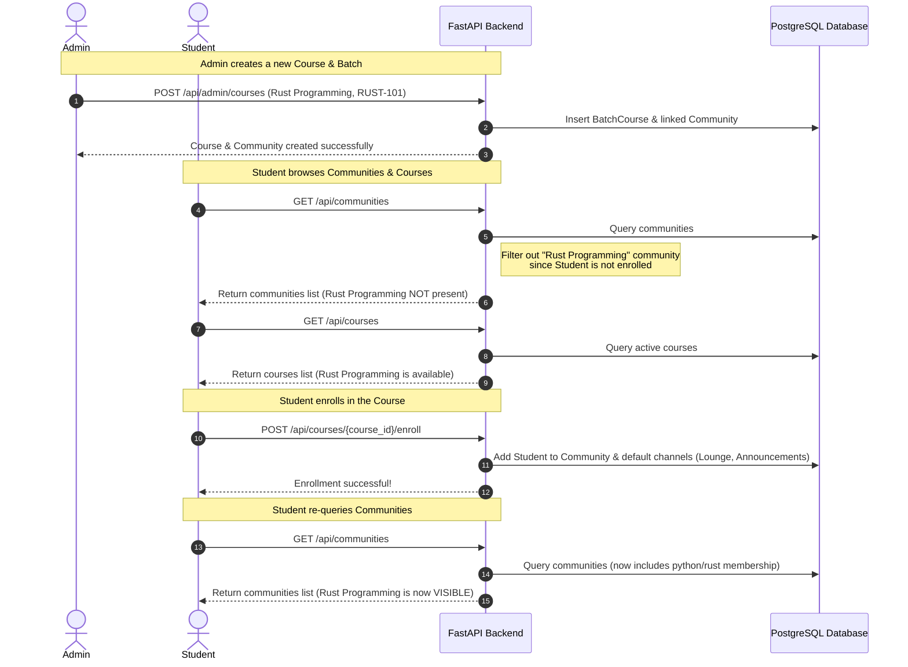
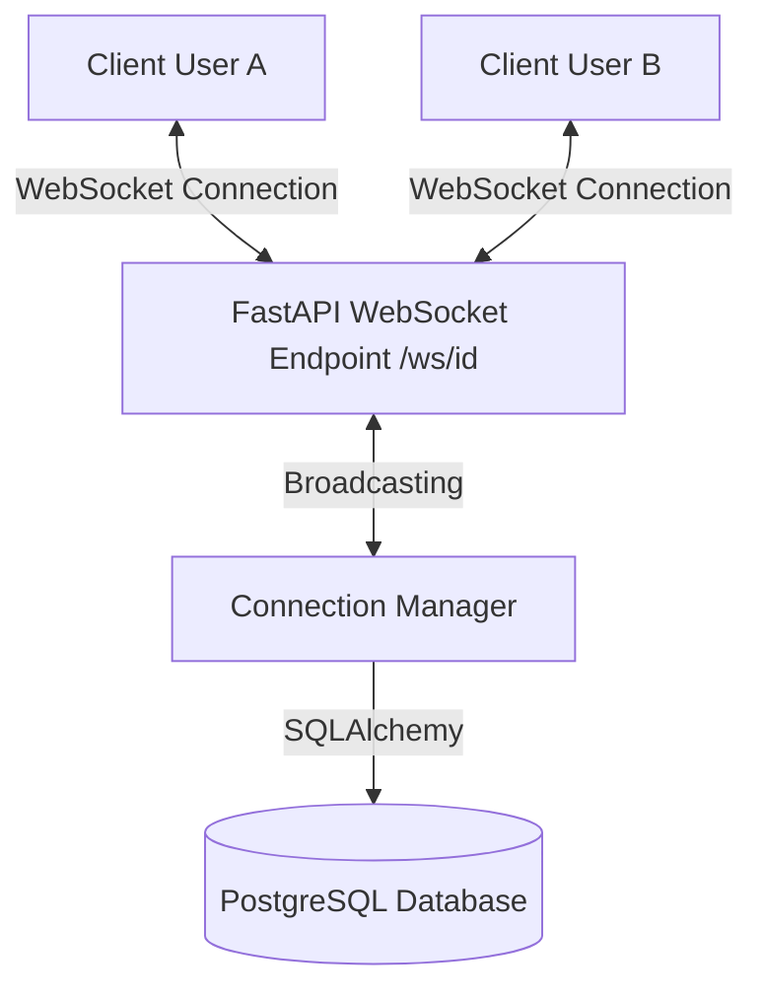

# Messaging Hub & Community Platform Documentation

Welcome to the **Messaging Hub & Community Platform** documentation. This document provides a comprehensive guide to the project's architecture, database models, user flows, real-time messaging subsystems, and course-community visibility controls.

---

## 🏗️ Project Architecture & Technology Stack

The platform is designed as a modern, decoupled web application split into a React-based frontend client and a FastAPI-based backend service.

```
┌────────────────────────────────────────────────────────┐
│                      Web Client                        │
│          (React, Tailwind CSS, Lucide React, Axios)    │
└───────────────────────────┬────────────────────────────┘
                            │
               HTTP APIs    │    WebSockets (WS)
              (JSON Body)   │   (Real-time Chat)
                            ▼
┌────────────────────────────────────────────────────────┐
│                   FastAPI Backend                      │
│        (Python 3, SQLAlchemy ORM, Uvicorn Server)       │
└───────────────────────────┬────────────────────────────┘
                            │
                            ▼
┌────────────────────────────────────────────────────────┐
│                   PostgreSQL Database                  │
└────────────────────────────────────────────────────────┘
```

### 1. Backend Service
- **Core Framework**: Python FastAPI for high-performance, asynchronous REST and WebSocket API endpoints.
- **ORM & Database**: SQLAlchemy with PostgreSQL (`psycopg2` driver).
- **Authentication**: JWT (JSON Web Tokens) with a custom dependency injection flow.
- **Server**: Uvicorn ASGI server.

### 2. Frontend Client
- **Core Framework**: React + Vite (Fast HMR development).
- **Styling**: Tailwind CSS for modern responsive aesthetics.
- **Icons**: Lucide React.
- **State & Networking**: Axios with request/response interceptors for token attachment and automatic logout on 401s.

---

## 🗄️ Database Models & Relationships

The database is built on SQLAlchemy models reflecting the following entities and relations:

| Model | Table Name | Key Attributes | Relationships & Description |
| :--- | :--- | :--- | :--- |
| **User** | `users` | `id`, `name`, `email`, `password`, `is_admin`, `online_status` | One-to-many with comments, posts, sent messages, reactions, memberships. |
| **Community** | `communities` | `id`, `name`, `creator_id`, `community_type` (`public`/`private`/`restricted`) | Contains group conversations and feed posts. |
| **CommunityMember** | `community_members` | `id`, `community_id`, `user_id`, `role` (`admin`/`member`) | Resolves user membership inside a community. |
| **BatchCourse** | `batch_courses` | `id`, `name`, `batch_code`, `status`, `creator_id`, `community_id` | Represents academic batches linked to a corresponding `Community`. |
| **Conversation** | `conversations` | `id`, `name`, `type` (`one_to_one`/`group`/`batch`/`project`), `community_id` | Contains messages; can be independent DMs or community group channels. |
| **ConversationMember** | `conversation_members` | `id`, `conversation_id`, `user_id` | Resolves user access to a specific chat thread. |
| **Message** | `messages` | `id`, `conversation_id`, `sender_id`, `content`, `message_type`, `file_url`, `is_read`, `is_pinned` | Individual message logs with type supporting text, images, or videos. |
| **MessageReaction** | `message_reactions` | `id`, `message_id`, `user_id`, `reaction_type` | Captures message emojis (e.g. `like`, `love`, `haha`, `fire`). |
| **Notification** | `notifications` | `id`, `user_id`, `type`, `reference_id`, `is_read` | Handles mentions, comments, new posts, and community invites. |

---

## ⚙️ Core User Flows & Access Control

### 1. Role-Based Access Control (RBAC)
- **Admin Users**: Identified by `is_admin = True`. Admins have exclusive access to:
  - Create and manage batch courses via the **Admin Portal**.
  - Edit or delete any community.
  - Create community channels (Announcements/Lounge).
  - Post in restricted Announcement channels.
- **Student Users**: Designated by `is_admin = False`. Students can:
  - Browse available courses.
  - Enroll in courses to join their communities.
  - Join public/restricted communities.
  - Chat in general channels (e.g., Lounge) and send Direct Messages.

---

### 2. Course Enrollment & Community Visibility Flow
To prevent cluttering and maintain course-batch privacy, communities linked to a batch course are hidden from students until they officially enroll.



---

### 3. Real-Time Chat & WebSockets Flow
Real-time messaging is powered by a WebSocket service mapping active client connections.



- **Connection Lifecycle**:
  1. The client opens a WebSocket connection to `ws://localhost:8000/api/ws/{user_id}` on mount.
  2. The server marks the user online and broadcasts `online_status` to all other connected clients.
  3. When a message is sent, it is persisted in the PostgreSQL database, and the `ConnectionManager` broadcasts the payload to all online members of that conversation thread.
- **Typing Indicators**:
  - Typing events send JSON payloads (`is_typing: true` / `false`) via WebSockets to conversation members to update UI states dynamically.
- **Read Receipts**:
  - When a message is viewed, the client sends a `read_receipt` event back via the WebSocket, marking the message `is_read = True` in the database and updating the checkmarks on the sender's client.

---

### 4. Community Feed & Engagement Flow
Communities support social-media-style feeds for announcements and discussions:
- **Posts**: Members can publish posts with textual content and attached photos/videos.
- **Likes**: Members can toggle likes on posts, instantly updating the count.
- **Comments & Replies**: Members can comment on posts. Comments support nested replies (one-level deep) for threaded conversations.

---

## 🌐 API Endpoint Reference

### 🔐 Authentication & Users
- `POST /api/register`: Create a new user account.
- `POST /api/login`: Authenticate credentials, return user attributes and JWT token.
- `GET /api/users/me`: Fetch the current logged-in user profile.
- `GET /api/users`: Search and list directory users (for starting direct messages).

### 👥 Community Management
- `GET /api/communities`: List all visible communities.
- `POST /api/communities`: Create a new community (Public, Private, or Restricted).
- `PUT /api/communities/{id}`: Edit community metadata (Admins only).
- `DELETE /api/communities/{id}`: Delete community (Creator only).
- `POST /api/communities/{id}/join`: Join a community.
- `POST /api/communities/{id}/leave`: Leave a community.
- `GET /api/communities/{id}/members`: List members of a community.
- `GET /api/communities/{id}/groups`: List channels in a community.
- `POST /api/communities/{id}/groups`: Create a new channel (Admins only).

### 🎓 Courses & Batches
- `GET /api/admin/courses`: List all batch courses (Admins only).
- `POST /api/admin/courses`: Create a batch course and automatic linked community (Admins only).
- `GET /api/courses`: List active courses with enrollment statuses.
- `POST /api/courses/{id}/enroll`: Enroll student in a course.

### 💬 Chat & Conversations
- `GET /api/conversations`: Fetch all chats the user is a member of.
- `POST /api/conversations`: Create or retrieve a DM/Group chat.
- `GET /api/conversations/{id}/messages`: Load chat history.
- `POST /api/conversations/{id}/messages`: Send a message (Text, Image, or Video).
- `PUT /api/messages/{id}/pin`: Pin/unpin a message.
- `POST /api/messages/{id}/react`: Add reaction emoji to a message.

---

## 🚀 Setup & Execution Guide

### Backend Setup
1. Navigate to the `backend/` directory:
   ```bash
   cd backend
   ```
2. Create and activate a Python virtual environment:
   ```bash
   python -m venv venv
   venv\Scripts\activate
   ```
3. Install dependencies:
   ```bash
   pip install -r requirements.txt
   ```
4. Copy the environment template and configure DB credentials:
   ```bash
   cp .env.example .env
   ```
5. Initialize the database schema:
   ```bash
   python init_db.py
   ```
6. Spin up the FastAPI server:
   ```bash
   uvicorn app.main:app --reload
   ```

### Frontend Setup
1. Navigate to the `frontend/` directory:
   ```bash
   cd ../frontend
   ```
2. Install npm dependencies:
   ```bash
   npm install
   ```
3. Launch the Vite development server:
   ```bash
   npm run dev
   ```
4. Open your browser and navigate to `http://localhost:5173`.
